# 📚 BookLog (북로그)

**BookLog**는 독서를 사랑하는 사람들을 위한 독서 기록 및 공유 기반의 소셜 네트워크 플랫폼입니다.  
책을 읽고, 기록하고, 서로의 독서 경험을 나누며 새로운 책과 친구를 발견할 수 있는 공간을 제공합니다.

 

## 🌟 프로젝트 개요

- **프로젝트명**: BookLog (북로그)
- **팀명**: 도파민
- **기간**: 2025년 3월 4일 ~ 2025년 4월 18일
- **주요 기능**: 독서 기록 · AI 맞춤형 책 추천 · 유저 연결
- **리버스 엔지니어링**: SNS
- **챌린지 포인트**: 반응형 웹, 외부 API 활용

 

## 👩‍💻 팀원 소개

| 이름   | 역할         | 담당 업무 | GitHub |
|--------|--------------|-----------|--------|
| 권현정 | Front-End / 팀장 | - 로그인, 회원가입 페이지 개발 - UI 컴포넌트 개발 - 반응형 웹 구현 | [khj0721](https://github.com/khj0721) |
| 김효진 | Front-End / 일정 관리 | - 나의 서재 페이지 개발 - 메시지, 팔로우 기능 구현 - 개발 일정 관리 | [hyojin10](https://github.com/hyojin10) |
| 김혜수 | Back-End / DB | - 백엔드 개발 - 데이터베이스 설계 및 구현 - API 개발 | [hk678](https://github.com/hk678) |
| 김민지 | Front-End / 모델링 | - 프론트엔드 개발 총괄 - 메인 페이지 개발 - 헤더, 검색 기능 구현 | [Hanleeyun](https://github.com/Hanleeyun) |
| 국태은 | Front-End / 발표 | - 발표 자료 준비 - 반응형 웹 구현 - UI/UX 설계 | [TaeeunKuk](https://github.com/TaeeunKuk) |

 

## 🧠 기획 배경 및 필요성

### 배경
- **독서율 급감**: 2023년 국민독서실태조사에 따르면 성인의 독서율은 43.0%로 역대 최저치 기록
- **독서 모임 수요 증가**: 모임 플랫폼에서 독서 모임 관련 게시물 2.2배 증가
- **텍스트힙 현상**: 숏폼 콘텐츠에 대한 피로감으로 독서 문화와 텍스트 기반 콘텐츠 재조명
- **전자책 시장 성장**: 디지털 독서 플랫폼 매출 31% 증가

### 필요성
- **독서 경험의 체계적 기록과 공유**: 개인의 독서 경험을 기록하고 다른 사람과 공유할 수 있는 플랫폼
- **AI 기반 맞춤형 추천**: 개인 취향에 맞는 도서와 유사 취향의 독자 연결
- **통합적 독서 경험**: 발견, 선택, 독서, 기록, 공유를 아우르는 원스톱 독서 경험 제공

### 차별성
1. **AI 기반 맞춤형 도서 추천**
   - Gemini API 활용하여 사용자가 저장한 감명 깊은 문장 분석
   - 내용 기반의 정확한 취향 분석으로 유사 도서 추천

2. **유사 취향 유저 추천 시스템**
   - 자주 읽는 분야와 최근 독서 분야를 바탕으로 유사 취향 독자 연결
   - 독서 네트워크 확장과 다양한 관점 공유

3. **통합적 독서 경험**
   - 독서 기록, 분석, 시각화, 소셜 기능을 하나의 플랫폼에서 제공
   - 개인화된 독서 여정 관리

4. **데이터 기반 시각화**
   - 장르별, 월별 독서량 그래프로 독서 패턴 분석
   - 직관적인 데이터 시각화로 독서 습관 이해

 

## 🚀 서비스 핵심 기능

### 📌 메인 기능
1. **독서 기록**
   - 읽은 책/읽는 중/읽고 싶은 책 상태 관리
   - 별점, 리뷰, 태그, 감명 깊은 문장 저장
   - 독서 활동 타임라인 제공

2. **AI 기반 도서 추천**
   - Gemini API를 활용한 텍스트 분석
   - 사용자가 저장한 감명 깊은 구절 기반 유사 도서 추천
   - 독서 패턴에 따른 개인화된 추천

3. **유사 취향 유저 연결**
   - 주요 독서 분야와 최근 독서 기반 유저 매칭
   - 팔로우 시스템과 메시지 기능으로 소통
   - 독서 네트워크 형성

4. **나의 서재**
   - 독서 기록 관리(상태별, 날짜별)
   - 시각 그래프(장르별 원형 그래프, 월별 막대 그래프)
   - 프로필 및 독서 취향 관리

5. **검색 기능**
   - 도서관 정보나루 Open API 연동 도서 검색
   - 유저 검색 및 연결

### 🛠️ 추후 개발 예정 기능
- 독서 타이머 및 시간 측정 그래프
- 독서 취향 분석 테스트
- 배지 시스템(예: 10권 완독 시 지급)
- 연간/월간 독서 목표 설정 및 진행률 트래킹
- 독서 토론 기능

 

## 📊 기술 스택 및 도구

| 영역          | 사용 기술 및 도구                    |
|---------------|--------------------------------------|
| 프론트엔드     | React, HTML/CSS, JavaScript         |
| 백엔드        | Spring                              |
| 데이터베이스   | MySQL                               |
| API 활용       | 도서관 정보나루(Open API), Gemini API |

 

## 📅 개발 일정

| 단계           | 기간                 | 내용                       |
|----------------|----------------------|----------------------------|
| 기획           | 03.04 ~ 03.12    | 프로젝트 계획 및 보고       |
| 요구분석       | 03.13 ~ 03.18        | 요구사항 분석 및 명세 작성 |
| 설계           | 03.19 ~ 04.07        | DB/화면 설계               |
| 구현           | 04.07 ~ 04.15        | 기능 구현 및 단위 테스트   |
| 테스트         | 04.15 ~ 04.17        | 코드 통합 및 QA 테스트     |
| 시연 및 마무리 | 04.17 ~ 04.18        | 시연 및 배포 준비           |

 

## 🎯 기대 효과

- **개인화 경험**: AI 기반 맞춤형 추천과 시각화된 독서 분석
- **독서 네트워크 형성**: 유사 취향 독자들과의 소통 및 확장된 독서 경험

 

## 🔗 활용 방안

- 출판사/서점과의 제휴를 통한 마케팅 플랫폼으로 활용 가능
- 사용자 리뷰 및 데이터 분석을 통한 신간 기획 방향 제시
- 오프라인 독서 모임, 작가 강연회, 챌린지 연계 이벤트 진행

 

## 🔍 주요 화면

### 🔹 회원가입, 로그인

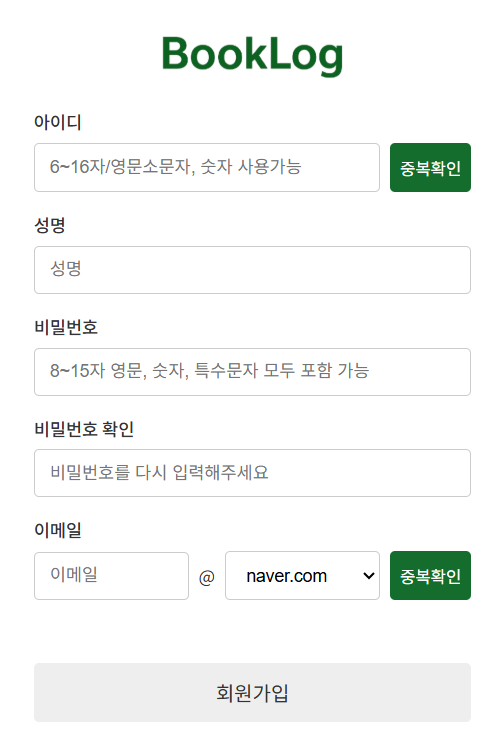
 
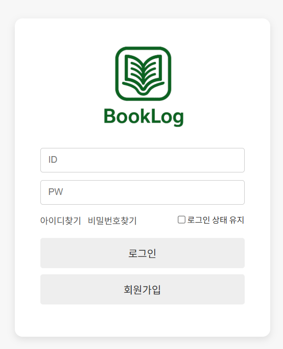

---

### 🔹 메인 페이지

- 기능: 다른 사용자들의 독서 기록 타임라인 
- 특징: 좋아요/댓글 기능
  
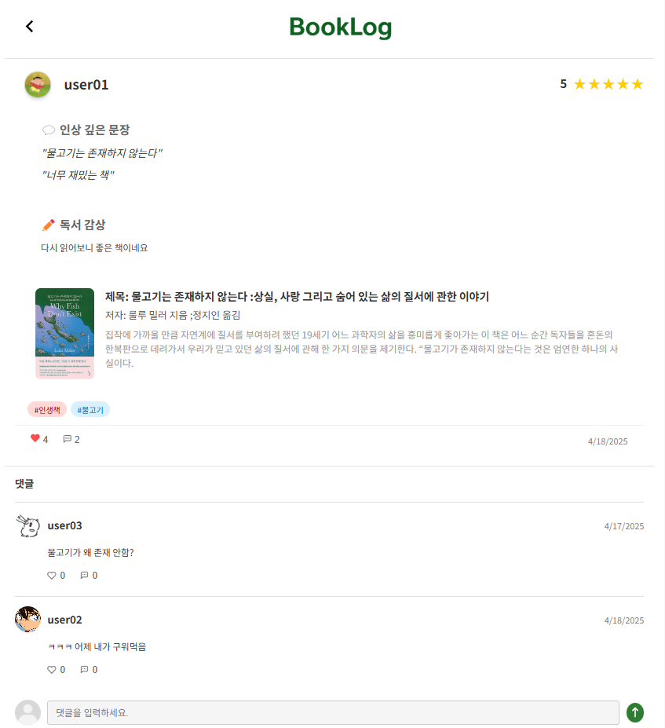
- 기능: 독서 기록 상세 보기, 댓글 작성 
- 특징: 책 정보 연결
  
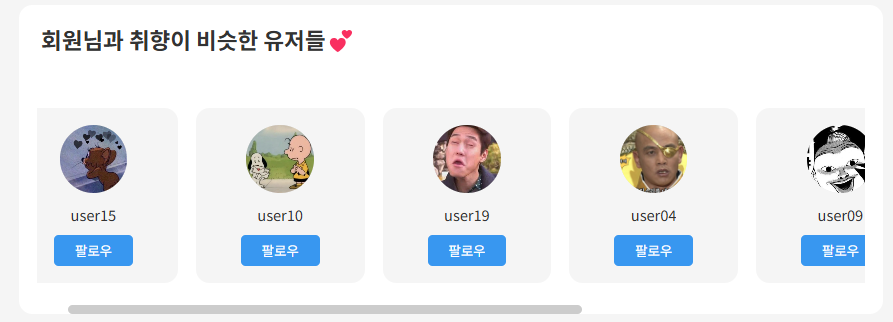
- 기능: 유사 독서 취향을 가진 사용자 추천 
- 특징: 주요 독서 분야, 최근 읽은 책 기반 매칭 알고리즘
  
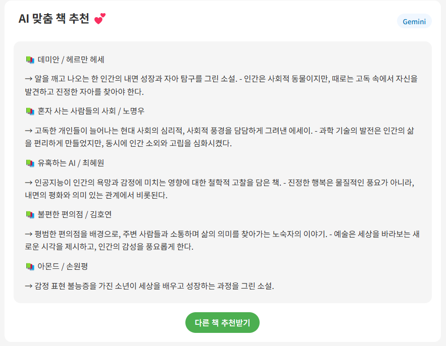
- 기능: AI 기반 맞춤형 도서 추천 
- 특징: 내가 저장한 인용문 추출해해 Gemini API 활용하여 도서 추천

---

### 🔹 나의 서재

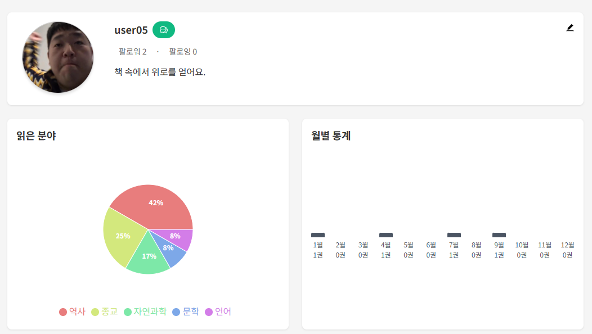
- 기능: 사용자 프로필, 독서 통계, 시각화 그래프 
- 특징: 장르별 원형 그래프, 월별 독서량 막대 그래프
  
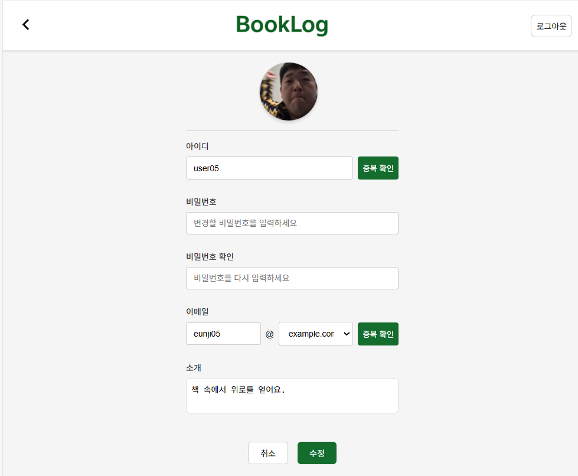
 
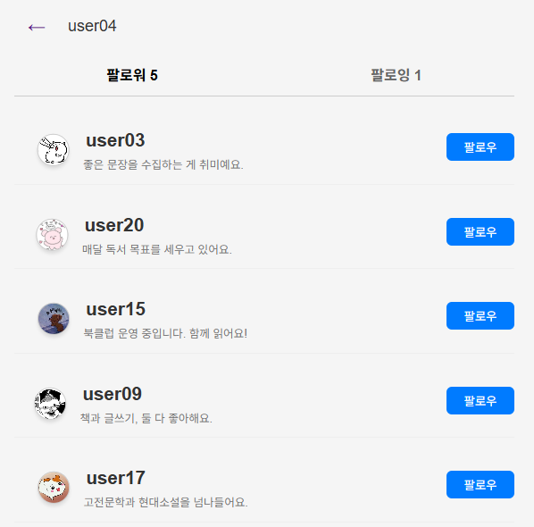
 
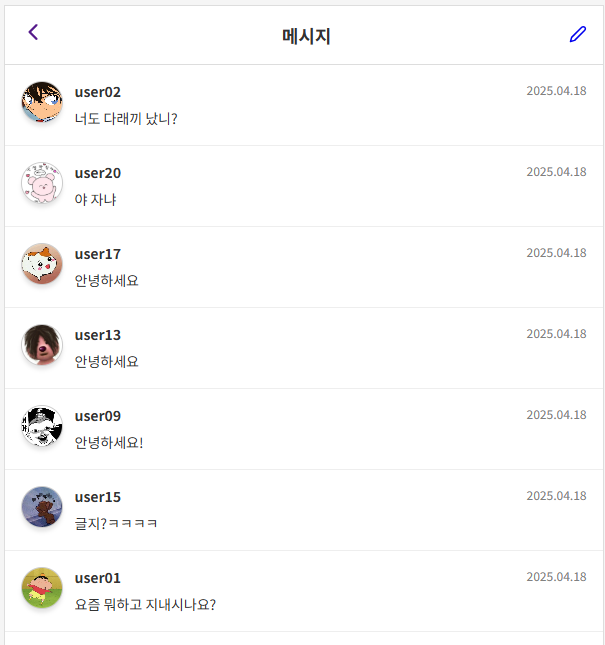
 
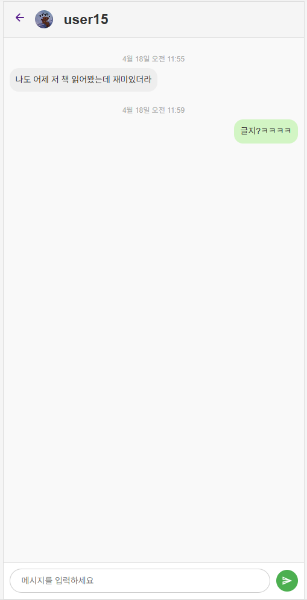
 
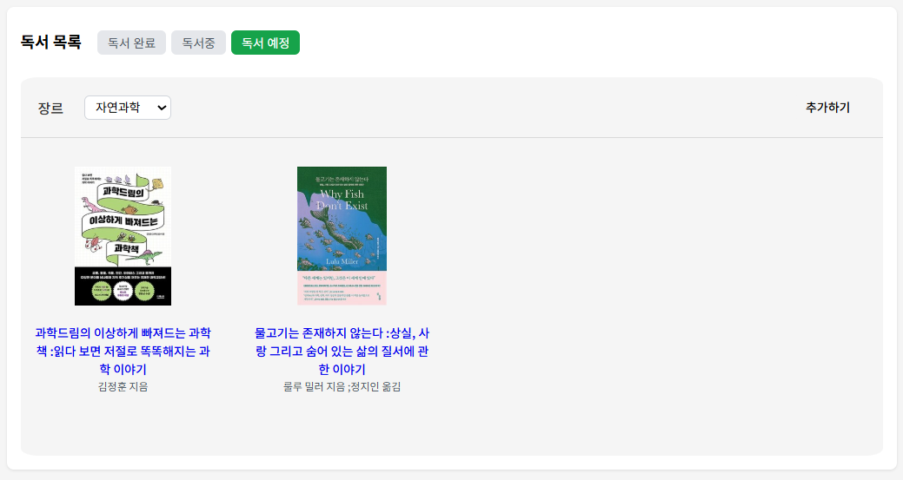
- 기능: 상태별(읽은/읽는 중/읽고 싶은) 도서 관리 
- 특징: 장르별 필터링
  
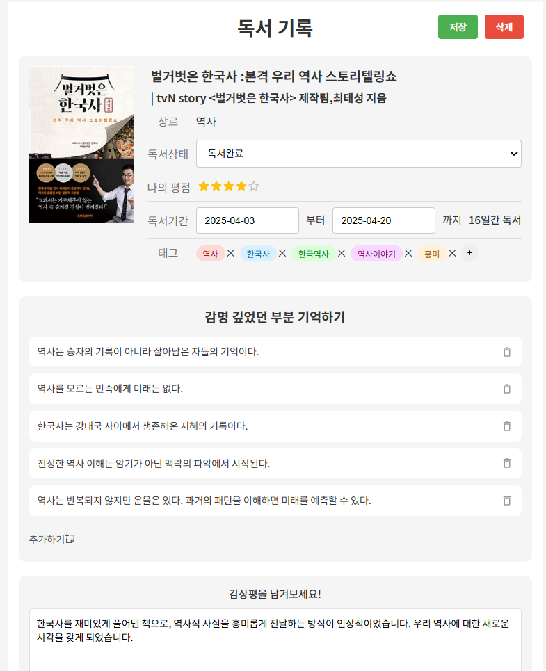
- 기능: 독서 기록 편집(별점, 리뷰, 태그, 감명 깊은 부분 등)

---

### 🔹 유저, 책 검색 & 책 디테일

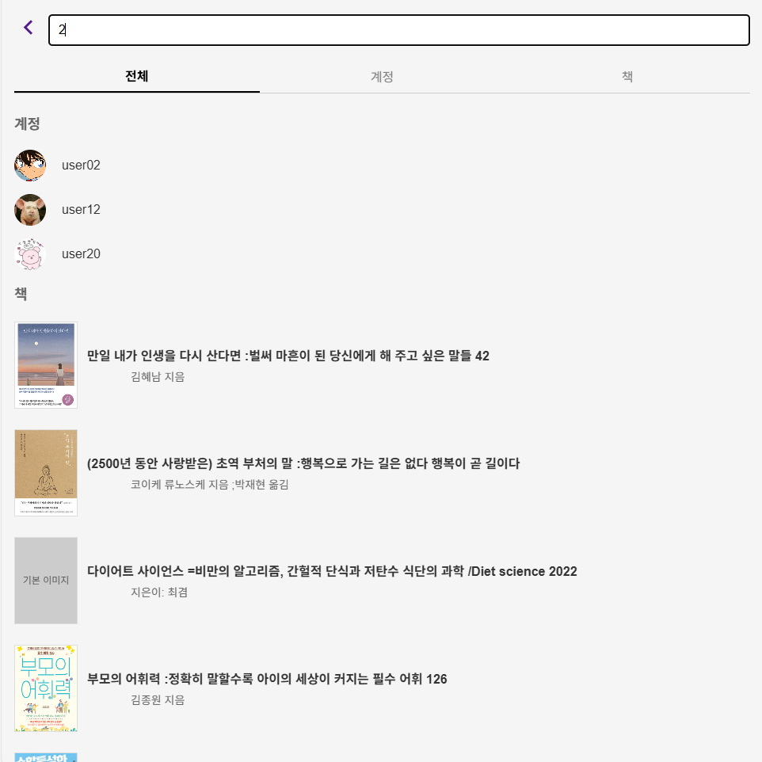
- 기능: 통합 검색(책, 유저)
  
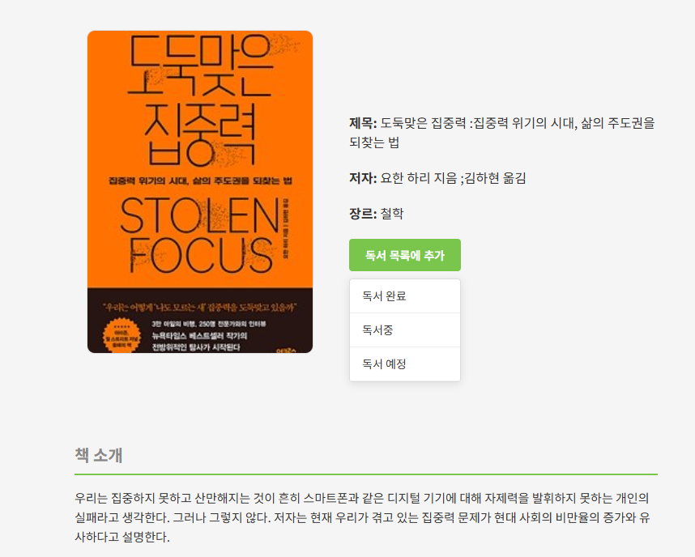
- 기능: 도서 정보 조회, 독서 상태 선택하여 추가 
- 특징: 도서관 정보나루 API 연동
  
