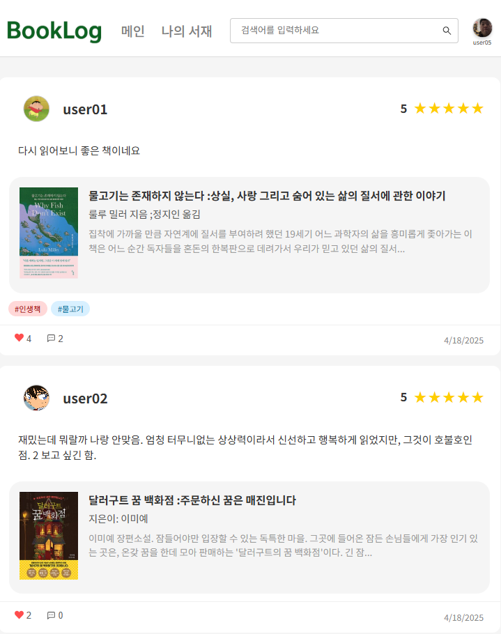

# 📚 BookLog - 독서가들을 위한 소셜 네트워크 서비스

**BookLog**는 독서를 사랑하는 사람들을 위한 독서 기록 및 공유 기반의 소셜 네트워크 플랫폼입니다.  
책을 읽고, 기록하고, 서로의 독서 경험을 나누며 새로운 책과 친구를 발견할 수 있는 서비입니다.

---

## 🌟 프로젝트 개요

- **프로젝트명**: BookLog (북로그)
- **팀명**: 도파민
- **기간**: 2025년 3월 4일 ~ 2025년 4월 18일
- **주요 기능**: 독서 기록 · AI 맞춤형 책 추천 · 유저 연결

---

## 👩‍💻 팀원 소개

| 이름   | 역할         |
|--------|--------------|
| 권현정 | 팀장 / Front-End |
| 김효진 | 일정 관리 / Front-End |
| 김혜수 | DB / Back-End |
| 김민지 | 모델링 / Back-End |
| 국태은 | 발표 / Front-End |

---

## 🧠 기획 배경

- **독서율 급감**: 국민 독서율 역대 최저치(2023년 기준 성인 43%)
- **필요성**: 독서 경험을 기록하고 공유할 수 있는 소셜 플랫폼의 필요성 증가
- **기술 트렌드**: AI 기반 개인화 추천 및 소셜 네트워킹의 수요 확대

---

## 🚀 서비스 핵심 기능

### 📌 메인 기능
- **독서 기록**: 감명 깊은 문장, 별점, 리뷰, 태그 입력 및 시각화
- **AI 기반 도서 추천**: Gemini API 활용 감명 깊은 문장 분석 → 유사 책 추천
- **유사 독서 취향 유저 추천**: 읽은 책 분야 기반 유사 독자 연결
- **나의 서재**: 독서 히스토리, 시각 그래프(장르별 원형, 월별 막대그래프)
- **검색 기능**: 책 검색(도서관 정보나루 API), 유저 검색

### 🛠️ 추후 개발 예정 기능
- 독서 타이머 및 시간 측정 그래프
- 독서 취향 분석 테스트
- 배지 시스템(예: 10권 완독 시 지급)
- 연간/월간 독서 목표 설정 및 진행률 트래킹
- 독서 토론 기능

---

## 📊 기술 스택 및 도구

| 영역          | 사용 기술 및 도구                    |
|---------------|--------------------------------------|
| 프론트엔드     | React, HTML/CSS, JavaScript         |
| 백엔드        | Spring                              |
| 데이터베이스   | MySQL                               |
| API 활용       | 도서관 정보나루(Open API), Gemini API |

---

## 📅 개발 일정

| 단계           | 기간                 | 내용                       |
|----------------|----------------------|----------------------------|
| 기획           | 03.04 ~ 03.12    | 프로젝트 계획 및 보고       |
| 요구분석       | 03.13 ~ 03.18        | 요구사항 분석 및 명세 작성 |
| 설계           | 03.19 ~ 04.07        | DB/화면 설계               |
| 구현           | 04.07 ~ 04.15        | 기능 구현 및 단위 테스트   |
| 테스트         | 04.15 ~ 04.17        | 코드 통합 및 QA 테스트     |
| 시연 및 마무리 | 04.17 ~ 04.18        | 시연 및 배포 준비           |

---

## 🎯 기대 효과

- **개인화 경험**: AI 기반 맞춤형 추천과 시각화된 독서 분석
- **독서 네트워크 형성**: 유사 취향 독자들과의 소통 및 확장된 독서 경험

---

## 🔗 활용 방안

- 출판사/서점과의 제휴를 통한 마케팅 플랫폼으로 활용 가능
- 사용자 리뷰 및 데이터 분석을 통한 신간 기획 방향 제시
- 오프라인 독서 모임, 작가 강연회, 챌린지 연계 이벤트 진행

---

## 🔍 주요 화면

### 🔹 회원가입, 로그인

 

---

### 🔹 메인 페이지

 

 

 

---

### 🔹 나의 서재

 

 

 

 

 

 

---

### 🔹 유저, 책 검색 & 책 디테일

 

